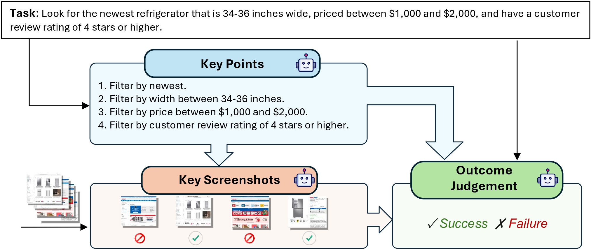

<h1 align="center"> Online-Mind2Web Benchmark </h1>

<p align="center">
  <a href="https://xuetianci.github.io/" style="text-decoration: none;">Tianci Xue<sup>,1</sup></a>, 
  <a href="https://x.com/weijian_qi" style="text-decoration: none;">Weijian Qi<sup>*,1</sup></a>,
  <a href="https://tnshi.com/" style="text-decoration: none;">Tianneng Shi<sup>*2</sup></a>,
  <a href="https://chanh.ee/" style="text-decoration: none;">Chan Hee Song<sup>1</sup></a>,
  <a href="https://boyugou.github.io/" style="text-decoration: none;">Boyu Gou<sup>1</sup></a>,
  <a href="https://dawnsong.io/" style="text-decoration: none;">Dawn Song<sup>,2</sup></a>,
  <a href="https://u.osu.edu/ihudas/people/" style="text-decoration: none;">Huan Sun<sup>†,1</sup></a>
  <a href="https://ysu1989.github.io/" style="text-decoration: none;">Yu Su<sup>†,1</sup></a>
</p>

<p align="center">
  <sup>1</sup>The Ohio State University, <sup>2</sup>University of California, Berkeley </br>
  <sub><sup>*</sup>Equal contribution, <sup>†</sup>Equal advising</sub>
</p>

<p align="center">
<a href="https://arxiv.org/abs/2504.01382">📃 Paper</a>
•
<a href="https://tiancixue.notion.site/An-Illusion-of-Progress-Assessing-the-Current-State-of-Web-Agents-1ac6cd2b9aac80719cd6f68374aaf4b4?pvs=4">📃 Blog</a>
•
<a href="https://huggingface.co/spaces/osunlp/Online_Mind2Web_Leaderboard" >🏆 Leaderboard</a>
•
<a href="https://huggingface.co/datasets/osunlp/Online-Mind2Web" >🤗 Data</a>
</p>


# Online-Mind2Web benchmark

## News
* [11/03/2025] We’ve updated 36 tasks that are no longer valid or involve websites with CAPTCHA verification. Please check out the updated tasks!
* [07/08/2025] 🎉 Online-Mind2Web has been accepted to COLM 2025!
* [05/11/2025] Check out our updates in the [paper](https://arxiv.org/abs/2504.01382).
  * The performance of Claude Computer Use 3.7.
  * WebJudge(o4-mini) achieves high agreement (86%) with a low success rate gap (3.8%) compared with humans.
  * Release [WebJudge-7B](https://huggingface.co/osunlp/WebJudge-7B), a robust and reliable reward model for Reinforcement learning.

## Tasks
Online-Mind2Web includes 300 diverse tasks from 136 popular websites across various domains. It covers a diverse set of real-world user tasks, such as clothing, food, housing, and transportation, to evaluate web agents' performance in a real-world online environment.

## Update Tasks

We will regularly update Online-Mind2Web by replacing outdated or invalid tasks (e.g., due to website changes) to maintain its value as a rigorous benchmark for web agents. If you find any tasks are outdated, please reach out to us, and we will update them.

To ensure fair comparisons, we will aim to keep the updated tasks on the same websites as before and with a similar reference length. Additionally, once agent performance saturates on Online-Mind2Web, we will also revise simple tasks to preserve its long-term value.

### Update History
#### 2026/01/02
<details>
<summary>🧩 Updated Task IDs</summary>
['547f5729c59d5d12a457a3ebb74c31c6']
</details>

#### 2025/12/14
<details>
<summary>🧩 Updated Task IDs</summary>
['c698ff3fc0f6cbce39947c597ab5749b', '50d91eabde542906937ab4c5b6f8f23a']
</details>

#### 2025/12/11
<details>
<summary>🧩 Updated Task IDs</summary>
['b64f938af842f6a1b4489d0e49a785a7', '7e1047f4803237f319c004f7a7f6bccb', 'c94551d2b18f9ad0ab31b0bd98ca42e3', '47186fac8e7c7277af01144644eb4e0b', '78baf9dbe7c3532f7d7ef4cc22a7f065']
</details>

#### 2025/11/23
<details>
<summary>🧩 Updated Task IDs</summary>
['9829f3087ab1f9c8eba6b6dd2b831d25', '1bc154377120ec15b18dbabdba49c741']
</details>

#### 2025/11/03
**Update summary:**  
Based on community feedback, we updated 36 tasks that were no longer valid or involved websites with CAPTCHA verification. The updated tasks were carefully designed to preserve similar difficulty and task types, ensuring fair comparison with prior results.

<details>
<summary>🧩 Updated Task IDs</summary>
['b7258ee05d75e6c50673a59914db412e', '824eb7bb0ef1ce40bfd49c12182d9428', '8f2611047de227a2ca8bda13f6e2e5fb', '62f1626ce249c31098854f8b38bdd6cf', '79f0bd7df6e685f30f20025cc6755c0a', '5e1b8254c123c80178cc28e0afdb14f0', '816851ff92ff0219acf4364dcc2c4692', 'e7301bb694871429bf2eb36c3a72186c', '3c1ffc3f494e423b3c434c79e35da8f3', '9f1cba613830ca1c6a58f9498c06e679', '9c97bab9c2abfb90a426cbe9addae8d0', '2fc51dd3febd447f0fdcdabca8d944ce', 'eb323dc584156d0eb3a2b90bb8c4b791', 'a0a18ca6a3529f3e97c771aadd42d3a0', 'e7f6cca9a8875f98fee3b711ead3a444', 'f2be37a9a60fbc25b6b11cf622d17352', '2d5a7f95f951a26838289dfd629ae850', '502e864440283214e0180645015f568b', '3adeea7627f4343069f38adae40f73d0', '8f80e64e44e1fada018997b2fe869683', '0a0fa834ce41b5297c6474293383759d', '64345c365f544375357c7b67917f08a0', '33bd2cdcea4fcc42a09a8a1e4e5841c6', '3dca7cbe7d086619d837ff9f5312cebc', '11857213ca01510f12813740afd59918', 'd730f4ff450da1bd60a836163736ef6a', 'fe33894188d20d7469f37a9fd855e7ff', 'e43cbc8a0bf9e999884928d11006f894', 'c577a14301a725e09ccd269a3e0b271e', '2c8ef01a92c71ba9ef2e59bb17eea2b3', '636b07af4dd97c1793733db1fd1b90b8', 'd8e2a81fa621ce4737e5ea85671b630e', '199be0b54a436daee74247971fc684ee', 'd1807551297ac60ecaaabbd2a2ed301a', 'dd44c665cec1e9c929a4c5f074e7844a', '1ab384fb3a791edfb410213cc6b82151']
</details>

---

#### 2025/04/05
<details>
<summary>🧩 Updated Task IDs</summary>
["c03ee2be3d73556ab789c0ad1cbd3451", "c181f903ec1107b850032c17cad88393", "2c8ef01a92c71ba9ef2e59bb17eea2b3", "d8e2a81fa621ce4737e5ea85671b630e", "63d6866fc000fcb1f153e07604bd1395", "199be0b54a436daee74247971fc684ee"]
</details>

# Automatic Evaluator via LLM-as-a-Judge (WebJudge)
To enhance the reliability and scalability of the evaluation process in online environments, We propose a more reliable automatic evaluation method called **WebJudge**, which consists of three parts. (1) Key Point Identification: The model is prompted to identify several key points necessary for completing the task, based on the given instruction and task description. (2) Key Screenshot Identification: Important screenshots are selected from the agent’s trajectory to retain relevant visual evidence while discarding uninformative frames. (3) Outcome Judgment: Output the judgement result based on the task description, key points, key screenshots, and the action history. Our method preserves critical intermediate screenshots while mitigating the token overload issue.

<p align="center">
  
</p>

# Results

## Comparison against Existing Evaluation Methods on Online-Mind2Web
<table>
<tr>
  <th>Model</th>
  <th>Auto-Eval</th>
  <td>SeeAct</td>
  <td>Agent-E</td>
  <td>Browser Use</td>
  <td>Claude 3.5 </td>
  <td>Claude 3.7</td>
  <td>Operator</td>
  <th>Avg AR</th>
</tr>
<tr>
  <th rowspan="4">GPT-4o</th>
  <td>Autonomous Eval</td>
  <td>84.7</td>
  <td>85.0</td>
  <td>76.0</td>
  <td>83.7</td>
  <td>75.5</td>
  <td>71.7</td>
  <td>79.4</td>
</tr>
<tr>
  <td>AgentTrek Eval</td>
  <td>73.0</td>
  <td>64.3</td>
  <td>63.3</td>
  <td>--</td>
  <td>--</td>
  <td>--</td>
  <td>66.9</td>
</tr>
<tr>
  <td>WebVoyager</td>
  <td>--</td>
  <td>75.3</td>
  <td>71.3</td>
  <td>74.0</td>
  <td>72.0</td>
  <td>76.7</td>
  <td>73.9</td>
</tr>
<tr>
  <td>WebJudge</td>
  <td>86.7</td>
  <td>86.0</td>
  <td>81.4</td>
  <td>86.3</td>
  <td>79.1</td>
  <td>81.8</td>
  <td><b>83.6</b></td>
</tr>

<tr>
  <th rowspan="3">o4-mini</th>
  <td>Autonomous Eval</td>
  <td>79.7</td>
  <td>85.7</td>
  <td>86.0</td>
  <td>84.3</td>
  <td>68.0</td>
  <td>73.3</td>
  <td>79.5</td>
</tr>
<tr>
  <td>WebVoyager</td>
  <td>--</td>
  <td>80.3</td>
  <td>79.0</td>
  <td>81.7</td>
  <td>74.3</td>
  <td>78.3</td>
  <td>78.7</td>
</tr>
<tr>
  <td>WebJudge</td>
  <td>85.3</td>
  <td>86.3</td>
  <td>89.3</td>
  <td>87.0</td>
  <td>82.3</td>
  <td>83.7</td>
  <td><b>85.7</b></td>
</tr>

<tr>
  <th></th>
  <td>WebJudge-7B</td>
  <td>86.0</td>
  <td>87.3</td>
  <td>88.3</td>
  <td>89.7</td>
  <td>84.3</td>
  <td>86.3</td>
  <td><b>87.0</b></td>
</tr>
</table>
WebJudge powered by GPT-4o and o4-mini consistently achieves the highest agreement, with averages of 83.6% and 85.7%, respectively. Meanwhile, WebJudge-7B even outperforms o4-mini, reaching a high agreement with human judgment of 87%.


## Excellent generalization capabilities on [AgentRewardBench](https://agent-reward-bench.github.io/) (5 OOD benchmarks)
| **Methods** | **AB** | **VWA** | **WA** | **Work** | **Wk++** | **Overall** |
|--------------|--------|--------|--------|----------|----------|--------------|
| *Rule-based** | 25.0 | **85.2** | 79.0 | 100.0 | 83.3 | 83.8 |
| Autonomous Eval* | 83.3 | 61.2 | 67.6 | 96.4 | 59.3 | 67.6 |
| GPT-4o (A11y Tree)* | 77.8 | 63.0 | 70.2 | 94.6 | 63.0 | 69.8 |
| WebJudge (GPT-4o) | 66.7 | 69.8 | 72.6 | 92.3 | 75.0 | 73.7 |
| WebJudge-7B | 80.0 | 66.7 | 77.5 | 100.0 | 70.0 | 75.7 |
| WebJudge (o4-mini) | **100.0** | 74.5 | **81.2** | **100.0** | **90.0** | **82.0** |

WebJudge significantly outperforms existing methods, achieving impressive overall precision of 73.7% 75.7% and 82.0% on WebArena (WA), VisualWebArena (VWA), AssistantBench (AB), WorkArena (Work) and WorkArena++ (Wk++) across 1302 trajectories.

The high precision suggests that WebJudge holds potential as a robust and scalable reward model for downstream applications such as Rejection Sampling Fine-Tuning, Reflection, and Reinforcement Learning.

# Model Release
We have released the fine-tuned [WebJudge-7B](https://huggingface.co/osunlp/WebJudge-7B) weights, which are now available on Hugging Face.

# Setup Environment

Create a conda environment and install dependencies:
```
conda create -n Online_Mind2Web python=3.11
conda activate Online_Mind2Web
pip install -r requirements.txt
```

# Evaluation
You can run the provided example evaluation script directly to perform the evaluation. Adjust the "mode" parameter to choose among various auto-eval methods.
```bash
bash ./script/eval.sh
```

## Important Notes for Reliable Evaluation on Online-Mind2Web:
> [!IMPORTANT]
> - **Start from the specified websites, not Google Search**:To enable fair comparisons, please ensure that each task starts from the specified website in our benchmark. Starting from Google Search or alternative websites can lead agents to use different websites to solve the task, resulting in varying difficulty levels and potentially skewed evaluation results.
> - **Include only factual actions, not agent outputs**: The action history should contain only the factual actions taken by the agent to complete the task (e.g., clicking elements and Typing text). Do not include the final response or any other agent's outputs, as they may contain hallucinated content and result in a high rate of false positives.
> - **Use o4-mini for WebJudge**: WebJudge powered by o4-mini demonstrates a higher alignment with human judgment, achieving an average agreement rate of 85.7% and maintaining a narrow success rate gap of just 3.8%. Therefore, please use o4-mini as the backbone for automatic evaluation.

# Evaluation Results

In certain scenarios, testing on the full Online-Mind2Web dataset may not be feasible due to cost, privacy, or legal constraints. To facilitate fair and apple-to-apple comparisons, we release both our human evaluation labels and auto-eval details.

- **Human Evaluation**: Task-level human evaluation labels are provided in the [file](https://github.com/OSU-NLP-Group/Online-Mind2Web/tree/main/data/evaluation_results/online_mind2web_evaluation_results/human_label.json).
- **Auto-Evaluation**: The results of WebJudge are available in the [folder](https://github.com/OSU-NLP-Group/Online-Mind2Web/tree/main/data/evaluation_results/online_mind2web_evaluation_results).

## Licensing Information

<a rel="license" href="http://creativecommons.org/licenses/by/4.0/"></a><br />The Online-Mind2Web dataset is licensed under a <a rel="license" href="http://creativecommons.org/licenses/by/4.0/">Creative Commons Attribution 4.0 International License</a>.

Code under this repo is licensed under a MIT License.

## 📚 Citation

Note: Online-Mind2Web is derived from the original Mind2Web dataset. We kindly ask that you cite both the original and this work when using or referencing the data.
```
@inproceedings{
  xue2025an,
  title={An Illusion of Progress? Assessing the Current State of Web Agents},
  author={Tianci Xue and Weijian Qi and Tianneng Shi and Chan Hee Song and Boyu Gou and Dawn Song and Huan Sun and Yu Su},
  booktitle={Second Conference on Language Modeling},
  year={2025},
  url={https://openreview.net/forum?id=6jZi4HSs6o}
}

@inproceedings{deng2023mind2web,
 author = {Deng, Xiang and Gu, Yu and Zheng, Boyuan and Chen, Shijie and Stevens, Sam and Wang, Boshi and Sun, Huan and Su, Yu},
 booktitle = {Advances in Neural Information Processing Systems},
 editor = {A. Oh and T. Naumann and A. Globerson and K. Saenko and M. Hardt and S. Levine},
 pages = {28091--28114},
 publisher = {Curran Associates, Inc.},
 title = {Mind2Web: Towards a Generalist Agent for the Web},
 url = {https://proceedings.neurips.cc/paper_files/paper/2023/file/5950bf290a1570ea401bf98882128160-Paper-Datasets_and_Benchmarks.pdf},
 volume = {36},
 year = {2023}
}
```
