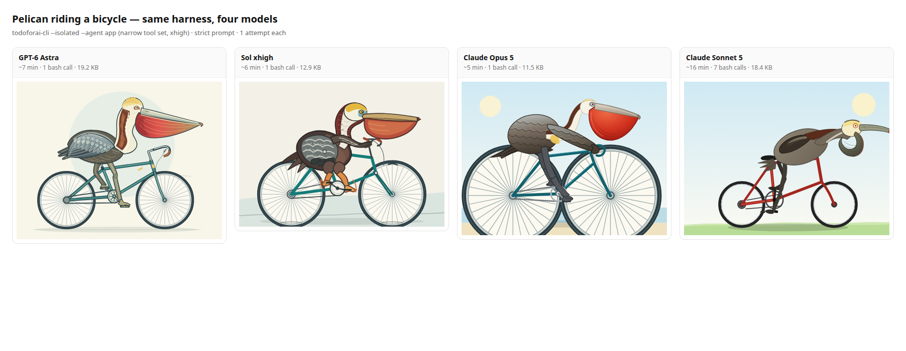

# Pelican-on-a-bicycle (Simon Willison's benchmark) — 2026-09-07 (+ astra 09-10)

Harness = the Terminal-Bench 82% config, unchanged (nothing drawing-specific):

    todoforai-cli --isolated --non-interactive --allow-all --path $PWD --agent app --model <model>

Agent `app` (`cecee14d`): systemMessage 79 chars, thinkingLevel **xhigh**, allow
`builtin:webfetch`, deny 16 patterns (question, create_todo, update_agent_settings,
vault_access, skill, google_search, html_snippet, business_onboarding, image_gen,
todoforai_api, todoforai-explore, todoforai-review, `*:WRITE|UPDATE|SEARCH|LIST`)
— effectively bash + read + webfetch. One attempt per model, SVG hand-written by the
agent, rasterized with headless Chrome (`render.sh`).

| Model | Wall | bash calls | SVG | Notes |
|---|---|---|---|---|
| gpt-6-astra (xhigh) | ~7 min | 1 | 19.2 KB, 1400×1080 | Best of the four: flat-illustration style, correct pouch + bill, layered scapular feathers, chain/chainring/derailleur, webbed feet on both pedals, 36-spoke wheels |
| gpt-5.6-sol (xhigh) | ~6 min | 1 | 12.9 KB, 1200×850 | Breeding plumage (yellow crown, chestnut hindneck), big red pouch, feather texture, feet on pedals + rotation arrows, full diamond frame with spokes |
| claude-opus-5 (xhigh) | ~5 min | 1 | 11.5 KB, 800×600 | Cleanest picture; red pouch, scalloped feathers, chain + chainring; body floats above the frame (no saddle contact). 1st attempt died on a provider stream stall, rerun fine |
| claude-sonnet-5 (xhigh) | ~16 min | 7 | 18.4 KB, 800×600 | Precomputed spokes/ticks into files, assembled in Python; weakest result: pouch reads as a hook, bird stretched flat over the frame, legs ambiguous |

Per-model: `results/<model>.svg` / `.png`, side-by-side `results/comparison.html`.

Subjective rank: **GPT-6 Astra > Opus 5 ≈ Sol > Sonnet 5**. Astra is the only one that
nails pouch, plumage and drivetrain at once (though the bird's posture is more standing
than seated). Opus is the prettier picture, Sol the more
anatomically literal one (pouch shape, plumage, pedaling actually indicated). Sonnet spent
7 tool calls and 3× the time on a worse drawing.

Gotchas
- Opus 5 first run failed at the provider ("stream stalled repeatedly"), not our infra.
- Editing `run.sh` while a run is live → the running bash reads garbage (`error reading
  input file`). Same rule as LESSONS.md: never edit a running script.
- No `rsvg-convert` on either box; `render.sh` uses headless Chrome and takes the size from
  the SVG's own viewBox (a fixed window silently crops, e.g. Sol's 1200×850).
- SVGs are recoverable from the todo messages via `GET /api/v1/todos/<id>/messages` if the
  machine that ran them is offline.
- The isolated bridge runs bash in its own workspace (`/tmp/todoforai`), not `--path`, so
  `pelican.svg` lands there; `run.sh` copies it back.
- A shell started by an agent inherits `TODOFORAI_PROJECT_ID`/`TODO_ID`/`AGENT_SETTINGS_ID`;
  with a *different* API key that's a 403 "Unauthorized to modify project". `run.sh` `env -u`s them.
