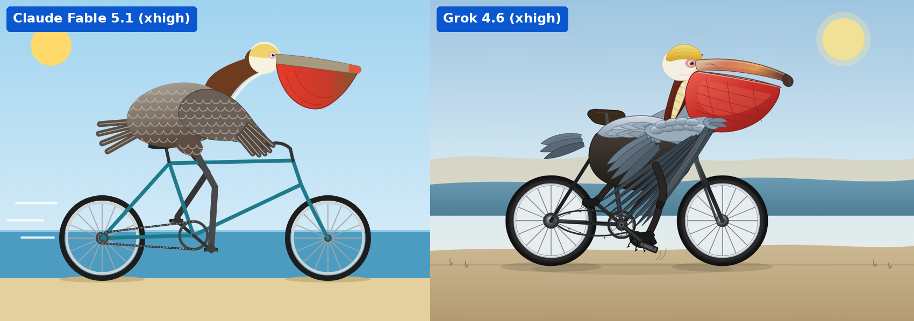

# Pelican — Fable 5.1 and Grok 4.6 (2026-09-10)

Same prompt (`prompt.txt`), benchmark `app` agent, isolated bridge. Separate TMPDIR per run. Served models verified from assistant message metadata:

- `anthropic:anthropic/claude-fable-5.1(xhigh)` — SVG written and renderable, but session ended ERROR: provider subscription pool exhausted. This is a partial run, not a clean completion.
- `xai:x-ai/grok-4.6(xhigh)` — session READY, SVG written and renderable.

Original SVG/PNG files: `results/claude-fable-5.1.*`, `results/grok-4.6.*`.
Comparison: `results/comparison-fable-grok.png` (original rendered images resized proportionally, labels overlaid; no generative edits).

